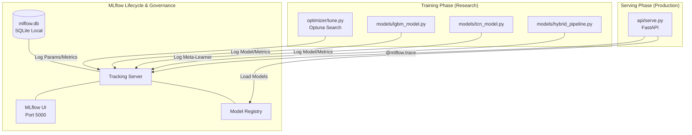

# GridTokenX: Predictive Intelligence Research Lab
**Ko Tao-Phangan-Samui AI Forecasting & Dispatch Research**

[](#)
[](#)
[](#)

## Research Objective
This codebase provides a high-fidelity environment for training and benchmarking predictive AI models for islanded microgrids. It is specifically tuned to solve the **bottleneck congestion** and **diesel efficiency** problems of the Ko Tao-Phangan-Samui cluster.

### 🚀 2026 Strategy Updates
As of May 2026, the system has been recalibrated for the modern Ko Tao grid:
- **15-Minute Intervals:** High-resolution forecasting and dispatch ($4\times$ resolution).
- **Post-Commissioning Physics:** Models trained on **Jan 2024 – Feb 2026** data, capturing the dynamics of the new 115 kV undersea cable.
- **Resilience-First:** Verified survival during **N-1 Contingency** (total cable failure) and **Cluster Bottlenecks** via ADMM coordination.

## 📊 Performance Benchmarks (2026 Strategy)

| Metric | Target (PEA) | Result (GridTokenX) |
| :--- | :--- | :--- |
| **12-Month Backtest MAPE** | < 10.0% | **2.92%** |
| **Mean Absolute Error (MAE)** | < 0.75 MW | **0.22 MW** |
| **R² Correlation** | > 0.85 | **0.955** |
| **N-1 Survival** | Required | **SUCCESS** |

## AI Model Architecture (The Hybrid Meta-Learner)
... (keep existing architecture sections) ...

## 2026 Commissioning Workflow
To verify the system against 2026 grid standards, run:

```bash
# 1. Run 12-month backtest (Stability check)
just backtest-12m

# 2. Run N-1 contingency stress test (Resilience check)
just stress-test

# 3. Run Cluster-wide bottleneck test (ADMM coordination)
just cluster-test

# 4. Generate full commissioning report & dashboard
just report
```

Full report details: [`results/commissioning_report.md`](results/commissioning_report.md)
Visual dashboard: `results/commissioning_dashboard.png`

## Network Single-Line Diagram
...

    subgraph "Data Acquisition & Processing"
        DS1[Synthetic Data Gen] --> PRE[Preprocessing]
        DS2[Thira/KIREIP/NREL Datasets] --> PRE
        PRE --> FE[Feature Engineering: Heat Index, Lags, Seasonal Indices]
    end

    subgraph "Hybrid Meta-Learner Architecture"
        FE --> TCN[Sequential Layer: TCN<br/>Causal Dilated Convolutions]
        FE --> LGBM[Tabular Layer: LightGBM<br/>Weather & Exogenous Correlations]
        
        TCN --> META[Meta-Learner: Ridge Blending]
        LGBM --> META
        
        META --> OUT[Load Forecast<br/>MAPE < 2.65%]
    end

    subgraph "Optimization & Evaluation"
        OPT[Optuna Tuner] -.-> |Hyperparams| TCN
        OPT -.-> |Hyperparams| LGBM
        OUT --> EVAL[Evaluation Engine<br/>Benchmark vs. PEA Targets]
    end

    subgraph "Application Layer"
        EVAL --> DISPATCH[Proactive Diesel/BESS Dispatch]
    end

    style META fill:#f96,stroke:#333,stroke-width:2px
    style OUT fill:#dfd,stroke:#333,stroke-width:2px
```

1. **Sequential Layer (TCN):** A Temporal Convolutional Network with causal dilated convolutions. It excels at capturing the long-term patterns of tourism-driven load curves.
2. **Tabular Layer (LightGBM):** Handles non-linear correlations between dry-bulb temperature, humidity (Heat Index), and peak A/C demand.
3. **Meta-Learner (Ridge):** A blending layer that intelligently weights the TCN and LGBM outputs to achieve the engineering target of **MAPE < 2.65%**.

## Experiment Tracking & Observability
We utilize **MLflow** for rigorous experiment governance and real-time inference profiling.



## Training Pipeline
To reproduce the research benchmarks, execute the following flow:

```bash
# 1. Generate 4-Year Synthetic Research Dataset
python data/generate_dataset.py

# 2. Preprocess & Feature Engineering
# (Calculates Heat Index, Lags, and Seasonal Tourist Indices)
python data/preprocess.py

# 3. Optimize Hyperparameters (Optuna)
# Automates search for filters, kernel sizes, and learning rates
python optimizer/tune.py

# 4. Train Hybrid Models
python models/lgbm_model.py
python models/tcn_model.py
python models/hybrid_pipeline.py

# 5. Evaluate vs. Real-World Benchmarks
python evaluate.py
```

## Benchmarking Datasets
This codebase supports benchmarking against real-world island telemetry:
- **Thira (Santorini):** Used for tourism-driven seasonality.
- **King Island (KIREIP):** Used for BESS-Diesel transition validation.
- **NREL PERFORM:** Used for solar-load coincidence research.

## Google Colab Integration
For high-speed GPU training, use the provided `colab_benchmark.ipynb` configuration. The system automatically detects CUDA/MPS hardware to accelerate the TCN training phase.

## Network Single-Line Diagram

PEA 115 kV grid topology for the Ko Tao–Phangan–Samui cluster, sourced from OSM and Global Energy Monitor.

```
╔══════════════════════════════════════════════════════════════════════════════════════╗
║         KO TAO – PHANGAN – SAMUI CLUSTER  |  SINGLE LINE DIAGRAM                   ║
║         GridTokenX Predictive Intelligence Layer  |  PEA 115 kV Network             ║
╚══════════════════════════════════════════════════════════════════════════════════════╝

  MAINLAND GRID (230 kV)
  ══════════════════════
         │
  ┌──────┴──────────────────────────────────────────────────────────────────┐
  │  KHANOM POWER STATION                                                   │
  │  Gas Turbine Combined Cycle  |  970 MW  |  Khanom, Nakhon Si Thammarat │
  │  Coords: 99.860°E, 9.235°N                                              │
  └──────┬──────────────────────────────────────────────────────────────────┘
         │ 230 kV  (ขนอม-สุราษฎร์ธานี / ขนอม-นครศรีธรรมราช)
         │
  ┌──────┴──────┐
  │  KHANOM     │  ← Step-down transformer  230 kV / 115 kV
  │  SUBSTATION │     Coords: 99.859°E, 9.234°N
  └──────┬──────┘
         │
         │ 115 kV  HVDC KOH SAMUI CONNECTOR  (~23 km submarine cable)
         │ ⚡ BOTTLENECK ASSET — 30–40% congestion probability 18:00–21:00
         │
  ┌──────┴──────────────────────────────────────────────────────────────────┐
  │  SAMUI 3 SUBSTATION  (สถานีไฟฟ้าเกาะสมุย 3)                            │
  │  115 kV  |  minor_distribution  |  Coords: 100.020°E, 9.441°N          │
  └──────┬──────────────────────────────────────────────────────────────────┘
         │ 115 kV  KOH SAMUI EXPORT  (~10 km)
         │
  ┌──────┴──────────────────────────────────────────────────────────────────┐
  │  🏝  KO SAMUI LOAD                                                      │
  │  Base: ~55 MW  |  Peak (high season): ~95 MW  |  Std dev: 7.5 MW       │
  │  Profile: Strong diurnal  |  Hotel / Airport / Commercial dominant      │
  │  Events: Songkran (Apr), NYE (Dec), weekend spikes  ← HIGH VOLATILITY  │
  │  BESS 50 MWh / 8 MW  +  Diesel 10 MW backup                            │
  └─────────────────────────────────────────────────────────────────────────┘
         │  (separate 115 kV submarine cable, ~30 km north)
         │
  ┌──────┴──────────────────────────────────────────────────────────────────┐
  │  🏝  KO PHANGAN LOAD                                                    │
  │  Base: ~18 MW  |  Peak: ~26 MW  |  Std dev: 1.9 MW                     │
  │  Profile: Moderate diurnal  |  Tourism + residential                    │
  │  Events: Full Moon Party ~1×/month, 22:00–02:00 spike +2–5 MW          │
  │  BESS 50 MWh / 8 MW  +  Diesel 10 MW backup  ← MODERATE VOLATILITY    │
  └─────────────────────────────────────────────────────────────────────────┘
         │  (separate 115 kV submarine cable, ~40 km north)
         │
  ┌──────┴──────────────────────────────────────────────────────────────────┐
  │  🏝  KO TAO LOAD  ← PRIMARY FORECAST TARGET                            │
  │  Base: ~6.7 MW  |  Peak: ~7.7 MW  |  Std dev: 0.22 MW                 │
  │  Profile: Nearly flat diurnal  |  AC-dominated  |  Dive resort island  │
  │  Seasonal swing: ±0.15 MW only  ← STABLE                               │
  │  BESS 50 MWh / 8 MW  +  Diesel 10 MW  |  BSFC: 198.5 g/kWh @ 75%     │
  └─────────────────────────────────────────────────────────────────────────┘

  AI CONTROL LAYER
  ════════════════
  SCADA/Sensors ──► POST /stream/telemetry (hourly)
                         │
                    ┌────┴──────────────────────────────────────────────┐
                    │  StreamingEngine  |  Buffer: 48h window           │
                    │  TCN + LightGBM + Ridge  |  Horizon: 24h          │
                    └────┬──────────────────────────────────────────────┘
                         │
              ┌──────────┼──────────┐
              ▼          ▼          ▼
         Ko Tao      Phangan     Samui
         Dispatch    Dispatch    Dispatch
              └──────────┴──────────┘
                         │
                   ADMM Consensus (multi-island)
                   Early Warning (6h lookahead)
```

> Full diagram: [`docs/single_line_diagram.txt`](docs/single_line_diagram.txt)
