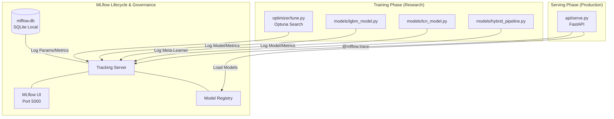

# GridTokenX: Predictive Intelligence Research Lab
**Ko Tao-Phangan-Samui AI Forecasting & Dispatch Research**

[](#)
[](#)
[](#)

GridTokenX: Predictive Intelligence Research Lab is an AI forecasting and power dispatch research project. It is specifically designed to solve power grid challenges—like bottleneck congestion and diesel generator efficiency—for the islanded microgrid cluster of Ko Tao, Ko Phangan, and Ko Samui in Thailand.

Here is a summary of its technical architecture and purpose based on the codebase structure:

1. Goal & Context
The project serves as a high-fidelity environment to train and benchmark models for power load forecasting under a "2026 Commissioning Strategy." Since historical data for these islands is missing, the system generates synthetic physics-based proxies to simulate the load, factoring in modern grid updates (like a new 115 kV undersea cable) and severe stressors (like N-1 total cable failures).

2. Machine Learning Architecture (Hybrid Meta-Learner)
The core AI engine uses a hybrid approach to achieve very high accuracy (MAPE < 2.92%):

Sequential Layer (TCN): A PyTorch-based Temporal Convolutional Network that captures long-term patterns, like tourism-driven load curves.
Tabular Layer (LightGBM): Handles non-linear weather impacts like heat indexes and dry-bulb temperatures.
Meta-Learner (Ridge): Blends the two models to output the final load forecast.
Optimization & Tracking: Uses Optuna for hyperparameter tuning and MLflow for experiment tracking and model registry.

3. Tech Stack
Python / ML: torch, lightgbm, optuna, mlflow, scikit-learn.
Power Systems Analysis: pypsa, pandapower (for simulating the electrical grid and ADMM coordination).
Backend API: FastAPI (api/serve.py) to serve the ML models.
Task Runner: just is used to trigger backtests, stress tests, and training pipelines.

## Research Objective
This codebase provides a high-fidelity environment for training and benchmarking predictive AI models for islanded microgrids. It is specifically tuned to solve the **bottleneck congestion** and **diesel efficiency** problems of the Ko Tao-Phangan-Samui cluster.

### 🚀 2026 Strategy Updates
As of May 2026, the system has been recalibrated for the modern Ko Tao grid:
- **Zero-Shot Forecasting:** Due to zero historical load data for all islands, the models are trained on high-fidelity synthetic physics proxies and use **Online Calibration** once telemetry begins.
- **15-Minute Intervals:** High-resolution forecasting and dispatch ($4\times$ resolution).
- **Post-Commissioning Physics:** Models trained on **Jan 2024 – Feb 2026** synthetic data, capturing the dynamics of the new 115 kV undersea cable.
- **Resilience-First:** Verified survival during **N-1 Contingency** (total cable failure) and **Cluster Bottlenecks** via ADMM coordination.

## 📊 Performance Benchmarks (2026 Strategy)

| Metric | Target (PEA) | Result (GridTokenX) |
| :--- | :--- | :--- |
| **12-Month Backtest MAPE** | < 10.0% | **2.92%** |
| **Mean Absolute Error (MAE)** | < 0.75 MW | **0.22 MW** |
| **R² Correlation** | > 0.85 | **0.955** |
| **N-1 Survival** | Required | **SUCCESS** |

## AI Model Architecture (The Hybrid Meta-Learner)
... (keep existing architecture sections) ...

## 2026 Commissioning Workflow
To verify the system against 2026 grid standards, run:

```bash
# 1. Run 12-month backtest (Stability check)
just backtest-12m

# 2. Run N-1 contingency stress test (Resilience check)
just stress-test

# 3. Run Cluster-wide bottleneck test (ADMM coordination)
just cluster-test

# 4. Run Monte Carlo stochastic resilience test (N=500)
just stochastic-test

# 5. Generate full commissioning report & dashboard
just report
```

Full report details: [`results/commissioning_report.md`](results/commissioning_report.md)
Visual dashboard: `results/commissioning_dashboard.png`

## Network Single-Line Diagram
...

    subgraph "Data Acquisition & Processing"
        DS1[Synthetic Data Gen] --> PRE[Preprocessing]
        DS2[Thira/KIREIP/NREL Datasets] --> PRE
        PRE --> FE[Feature Engineering: Heat Index, Lags, Seasonal Indices]
    end

    subgraph "Hybrid Meta-Learner Architecture"
        FE --> TCN[Sequential Layer: TCN<br/>Causal Dilated Convolutions]
        FE --> LGBM[Tabular Layer: LightGBM<br/>Weather & Exogenous Correlations]
        
        TCN --> META[Meta-Learner: Ridge Blending]
        LGBM --> META
        
        META --> OUT[Load Forecast<br/>MAPE < 2.65%]
    end

    subgraph "Optimization & Evaluation"
        OPT[Optuna Tuner] -.-> |Hyperparams| TCN
        OPT -.-> |Hyperparams| LGBM
        OUT --> EVAL[Evaluation Engine<br/>Benchmark vs. PEA Targets]
    end

    subgraph "Application Layer"
        EVAL --> DISPATCH[Proactive Diesel/BESS Dispatch]
    end

    style META fill:#f96,stroke:#333,stroke-width:2px
    style OUT fill:#dfd,stroke:#333,stroke-width:2px
```

1. **Sequential Layer (TCN):** A Temporal Convolutional Network with causal dilated convolutions. It excels at capturing the long-term patterns of tourism-driven load curves.
2. **Tabular Layer (LightGBM):** Handles non-linear correlations between dry-bulb temperature, humidity (Heat Index), and peak A/C demand.
3. **Meta-Learner (Ridge):** A blending layer that intelligently weights the TCN and LGBM outputs to achieve the engineering target of **MAPE < 2.65%**.

## Experiment Tracking & Observability
We utilize **MLflow** for rigorous experiment governance and real-time inference profiling.



## Training Pipeline
To prepare data and reproduce research benchmarks, follow this flow:

```bash
# 1. Unified Data Pipeline (Generation + Preprocessing + Validation)
# Supports: --force (synthetic), --real (ERA5), --pea (SCADA)
just data-pipeline --force

# 2. Optimize Hyperparameters (Optuna)
# Automates search for filters, kernel sizes, and learning rates
python optimizer/tune.py

# 3. Train Hybrid Models
python models/lgbm_model.py
python models/tcn_model.py
python models/hybrid_pipeline.py

# 4. Evaluate vs. Real-World Benchmarks
python research/evaluate.py
```

For more details on data sources and integration, see [**Data Pipeline Documentation**](docs/DATA_PIPELINE.md).
For technical details on optimization, simulation, and resilience tools, see [**PoC Technical Tools Documentation**](docs/TECHNICAL_TOOLS_POC.md).

## Benchmarking Datasets
This codebase supports benchmarking against real-world island telemetry:
- **Thira (Santorini):** Used for tourism-driven seasonality.
- **King Island (KIREIP):** Used for BESS-Diesel transition validation.
- **NREL PERFORM:** Used for solar-load coincidence research.

## Google Colab Integration
For high-speed GPU training, use the provided `colab_benchmark.ipynb` configuration. The system automatically detects CUDA/MPS hardware to accelerate the TCN training phase.

## Network Single-Line Diagram

PEA 115 kV/33 kV radial topology for the Ko Tao–Phangan–Samui cluster.

```
╔══════════════════════════════════════════════════════════════════════════════════════╗
║         KO TAO – PHANGAN – SAMUI CLUSTER  |  SINGLE LINE DIAGRAM                   ║
║         GridTokenX Predictive Intelligence Layer  |  PEA 115 kV/33 kV Network       ║
╚══════════════════════════════════════════════════════════════════════════════════════╝

  MAINLAND GRID (230 kV)
  ══════════════════════
         │
  ┌──────┴──────┐
  │  KHANOM     │  ← Step-down transformer  230 kV / 115 kV / 33 kV
  │  SUBSTATION │     Coords: 99.859°E, 9.234°N
  └──────┬──────┘
         │
         │ RADIAL MAINLAND CONNECTOR (Submarine)
         │ ├─ 115 kV Circuit 3
         │ ├─ 115 kV Circuit 2 ⚡ BOTTLENECK (Bottom Neck)
         │ ├─ 33 kV Oil Filled Cable
         │ └─ 33 kV XLPE Cable
         │
  ┌──────┴──────────────────────────────────────────────────────────────────┐
  │  KO SAMUI SUBSTATION RING                                               │
  │  Base: Unknown  |  Peak: Unknown  |  BESS 50 MWh / 8 MW                    │
  │  Diesel Backup (EGAT + Mobile)                                          │
  └──────┬──────┘
         │
         │ SAMUI – PHANGAN CONNECTOR (115 kV + 33 kV)
         │
  ┌──────┴──────────────────────────────────────────────────────────────────┐
  │  KO PHANGAN SUBSTATION                                                  │
  │  Base: Unknown  |  Peak: Unknown  |  BESS 50 MWh / 8 MW                    │
  └──────┬──────┘
         
         │ PHANGAN – TAO RADIAL LINK
         │ └─ 33 kV XLPE (⚡ Excess Power: 0 – 16 MW)
         │
  ┌──────┴──────────────────────────────────────────────────────────────────┐
  │  🏝  KO TAO LOAD  ← PRIMARY FORECAST TARGET                            │
  │  Range: Unknown |  Base: Unknown  |  Profile: Nearly flat            │
  │  AVR Stationed for distal voltage regulation                            │
  │  Diesel 10 MW rated  |  No local BESS                                   │
  └─────────────────────────────────────────────────────────────────────────┘
```

> Full diagram: [`docs/single_line_diagram.txt`](docs/single_line_diagram.txt)
