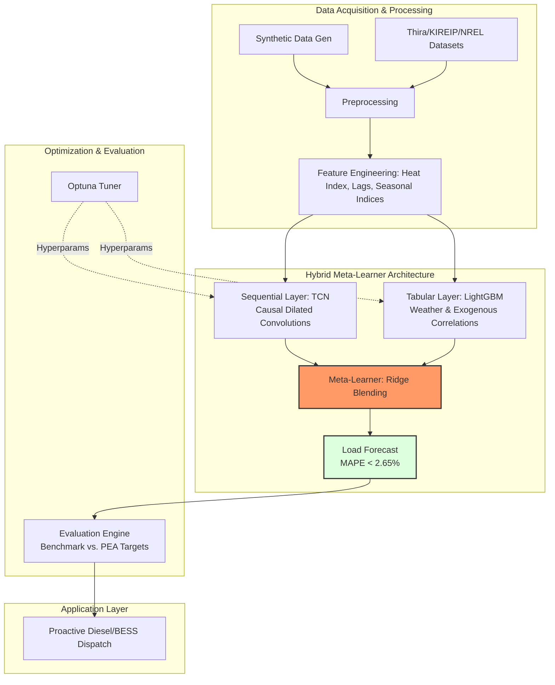
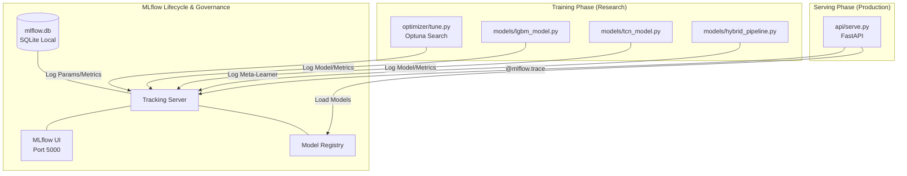

# GridTokenX: Predictive Intelligence Research Lab
**Ko Tao-Phangan-Samui AI Forecasting & Dispatch Research**

[](#)
[](#)
[](#)

## Research Objective
This codebase provides a high-fidelity environment for training and benchmarking predictive AI models for islanded microgrids. It is specifically tuned to solve the **bottleneck congestion** and **diesel efficiency** problems of the Ko Tao-Phangan-Samui cluster using a hybrid TCN-LGBM architecture.

## AI Model Architecture (The Hybrid Meta-Learner)
The core of this project is a multi-stage forecasting engine:



1. **Sequential Layer (TCN):** A Temporal Convolutional Network with causal dilated convolutions. It excels at capturing the long-term patterns of tourism-driven load curves.
2. **Tabular Layer (LightGBM):** Handles non-linear correlations between dry-bulb temperature, humidity (Heat Index), and peak A/C demand.
3. **Meta-Learner (Ridge):** A blending layer that intelligently weights the TCN and LGBM outputs to achieve the engineering target of **MAPE < 2.65%**.

## Experiment Tracking & Observability
We utilize **MLflow** for rigorous experiment governance and real-time inference profiling.



## Training Pipeline
To reproduce the research benchmarks, execute the following flow:

```bash
# 1. Generate 4-Year Synthetic Research Dataset
python data/generate_dataset.py

# 2. Preprocess & Feature Engineering
# (Calculates Heat Index, Lags, and Seasonal Tourist Indices)
python data/preprocess.py

# 3. Optimize Hyperparameters (Optuna)
# Automates search for filters, kernel sizes, and learning rates
python optimizer/tune.py

# 4. Train Hybrid Models
python models/lgbm_model.py
python models/tcn_model.py
python models/hybrid_pipeline.py

# 5. Evaluate vs. Real-World Benchmarks
python evaluate.py
```

## Benchmarking Datasets
This codebase supports benchmarking against real-world island telemetry:
- **Thira (Santorini):** Used for tourism-driven seasonality.
- **King Island (KIREIP):** Used for BESS-Diesel transition validation.
- **NREL PERFORM:** Used for solar-load coincidence research.

## Google Colab Integration
For high-speed GPU training, use the provided `colab_benchmark.ipynb` configuration. The system automatically detects CUDA/MPS hardware to accelerate the TCN training phase.
